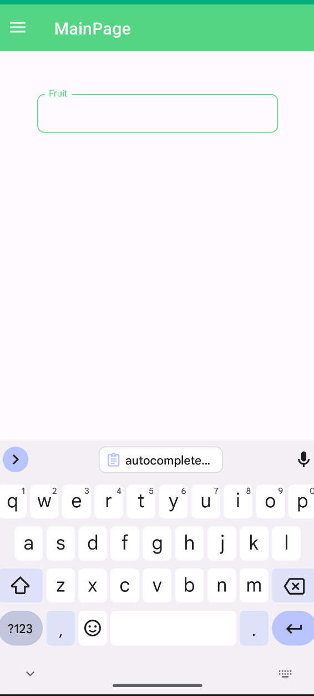
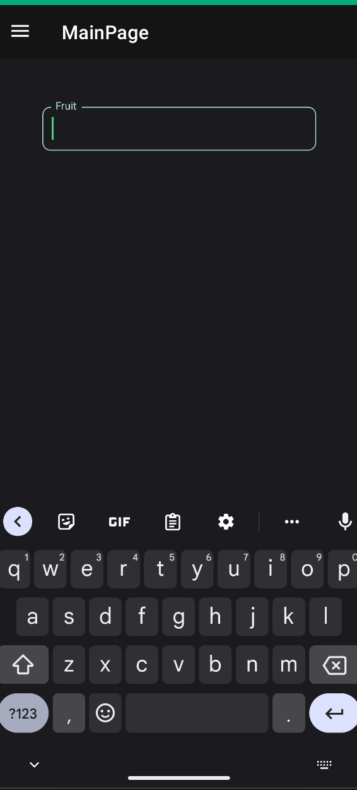

# AutoCompleteTextField
AutoCompleteTextField is a text field that provides suggestions as you type.

## Usage
AutoCompleteTextField is included in the `UraniumUI.Material.Controls` namespace. You should add it to your XAML like this:

```xml
xmlns:material="http://schemas.enisn-projects.io/dotnet/maui/uraniumui/material"
```

Then you can use it in a page like this:
    
```xml
<material:AutoCompleteTextField Title="Fruit">
    <material:AutoCompleteTextField.ItemsSource>
        <x:String>Apple</x:String>
        <x:String>Orange</x:String>
        <x:String>Banana</x:String>
        <x:String>Strawberry</x:String>
        <x:String>Watermelon</x:String>
        <x:String>Cherry</x:String>
        <x:String>Blueberry</x:String>
        <x:String>Blackberry</x:String>
        <x:String>Pineapple</x:String>
        <x:String>Coconut</x:String>
        <x:String>Apricot</x:String>
        <x:String>Avocado</x:String>
        <x:String>Plum</x:String>
        <x:String>Fig</x:String>
        <x:String>Grape</x:String>
        <x:String>Guava</x:String>
        <x:String>Lemon</x:String>
        <x:String>Lime</x:String>
        <x:String>Mango</x:String>
        <x:String>Passion Fruit</x:String>
        <x:String>Peach</x:String>
        <x:String>Pear</x:String>
        <x:String>Pomegranate</x:String>
        <x:String>Raspberry</x:String>
        <x:String>Tomato</x:String>
    </material:AutoCompleteTextField.ItemsSource>
</material:AutoCompleteTextField>
```

| Light | Dark |
| --- | --- |
|  |  |


## Icon
AutoCompleteTextFields support setting an icon on the left side of the control. You can set the icon by setting the `Icon` property. The icon can be any `ImageSource` object. FontImageSource is recommended as Icon since its color can be changed when focused.

```xml
 <material:AutoCompleteTextField
    Title="Fruit"
    Icon="{FontImageSource FontFamily=MaterialRegular, Glyph={x:Static m:MaterialRegular.Forest}}"/>
```


## Validation
Validation logic is exactly same with [InputKit Validations](https://enisn-projects.io/docs/en/inputkit/latest/components/controls/FormView#validations).


AutoCompleteTextFields support validation. You can define validations by using the `Validations` property. Validation is triggered when the text changes. If the validation fails, the error message is displayed. You can set the error message by setting the `ErrorMessage` property.

> See also [DataAnnotations](../../../validations/DataAnnotations.md)

```xml
<material:AutoCompleteTextField>
    <validation:RequiredValidation />
</material:AutoCompleteTextField>
```

### FormView Compatibility
AutoCompleteTextField is fully compatible with [FormView](https://enisn-projects.io/docs/en/inputkit/latest/components/controls/FormView). You can use it inside a FormView and it will work as expected.


```xml
<input:FormView Spacing="20">

    <material:AutoCompleteTextField 
        Title="Fruit" 
        Text="{Binding FruitText}"
        ItemsSource="{Binding FruitSuggestions}">
        <material:AutoCompleteTextField.Validations>
            <validation:RequiredValidation />
        </material:AutoCompleteTextField.Validations>
    </material:AutoCompleteTextField>

    <Button StyleClass="FilledButton"
            Text="Submit"
            input:FormView.IsSubmitButton="True"/>

</input:FormView>
```