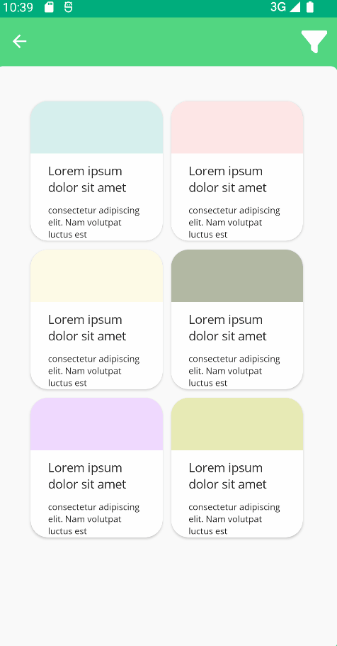

# Backdrop
A backdrop appears behind all other surfaces in an app, displaying contextual and actionable content.

You may visit [Material Design Backdrops](https://material.io/components/backdrop) to get more information.


| Regular Implementation |
| --- |
|  |

## Usage
Backdrop is an [attachment](../../../infrastructure/UraniumContentPage.md#attachments) of [UraniumContentPage](../../../infrastructure/UraniumContentPage.md). So, it can be used only together with UraniumContentPage.

Backdrop is included in `UraniumUI.Material.Attachments` namespace. Before starting to use Backdrop, you should add material namespace to your XAML file.

```
xmlns:material="http://schemas.enisn-projects.io/dotnet/maui/uraniumui/material"
```

To use a Backdrop, you should add a `Backdrop` to `UraniumContentPage.Attachments`. B

Backdrop has `Title` and `IconImageSource` property and one of them should be set. These are used in toolbar items. Title and Icon will be presented in toolbar items. That toolbaritem will open and close the Backdrop. If your page doesn't include AppBar or you hided it, you can name the backdrop and show/hide it in code.

```xml
<uranium:UraniumContentPage x:Class="App1.MainPage"
            xmlns="http://schemas.microsoft.com/dotnet/2021/maui"
            xmlns:x="http://schemas.microsoft.com/winfx/2009/xaml"
            xmlns:uranium="http://schemas.enisn-projects.io/dotnet/maui/uraniumui"
            xmlns:input="clr-namespace:InputKit.Shared.Controls;assembly=InputKit.Maui"
            xmlns:material="http://schemas.enisn-projects.io/dotnet/maui/uraniumui/material">

    <!-- Content here -->

    <uranium:UraniumContentPage.Attachments>
           <material:BackdropView Title="Filter" IconImageSource="filter.png">
            <VerticalStackLayout>
                <input:CheckBox Text="Include Disabled Items" Type="Filled" />
                <input:CheckBox Text="Include Deleted Items" Type="Filled" />
                <input:CheckBox Text="Show all categories" Type="Filled"/>
                <input:AdvancedSlider Title="Maximum Value" MinValue="0" MaxValue="1200" StepValue="10" MaxValueSuffix="items" />
            </VerticalStackLayout>
        </material:BackdropView>
    </uranium:UraniumContentPage.Attachments>
</uranium:UraniumContentPage>
```

### Properties

#### Title & IconImageSource
Both of `Title` and `IconImageSource` is used to add a toolbaritem. If you set `Title`, it will be used as a text of toolbaritem. If you set `IconImageSource`, it will be used as an icon of toolbaritem. If you set both of them, `Title` will be used as a hint text of toolbaritem. Visit [Toolbar Items Documentation](https://docs.microsoft.com/en-us/xamarin/xamarin-forms/user-interface/toolbaritem) for more information.


#### IsPresented
`IsPresented` is used to show/hide the Backdrop. If you set it to `true`, Backdrop will be shown. If you set it to `false`, Backdrop will be hidden. It's a bindable property, you can even bind it in XAML page. You can define `x:Name` for the bottom sheet and use it in your code.


```xml
<uranium:UraniumContentPage x:Class="App1.MainPage"
            xmlns="http://schemas.microsoft.com/dotnet/2021/maui"
            xmlns:x="http://schemas.microsoft.com/winfx/2009/xaml"
            xmlns:uranium="http://schemas.enisn-projects.io/dotnet/maui/uraniumui"
            xmlns:material="http://schemas.enisn-projects.io/dotnet/maui/uraniumui/material">

    <!-- Content here -->

    <uranium:UraniumContentPage.Attachments>
        <material:BackdropView x:Name="backdrop" Title="Filter" IconImageSource="filter.png">
            <!-- ... -->
        </material:BackdropView>
    </uranium:UraniumContentPage.Attachments>
</uranium:UraniumContentPage>
```

```csharp
private void OnButtonClicked(object sender, EventArgs e)
{
    backdrop.IsPresented = true;
}
```
